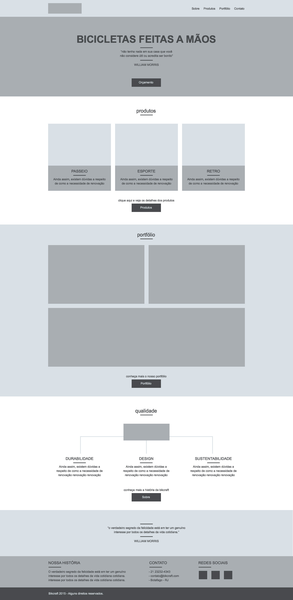

# Bikcraft
## Bicicletas Personalizadas

O desenvolvimento do site Bikcraft fez parte de um grande projeto de web design, que foi do design ao código.

O desenvolvimento se deu em seis etapas:

## Design

O design foi da estrutura de um wireframe ao design final, como escolha de cores, tipografia, espaçamentos e tudo relacionado ao design de interfaces.

O Photoshop foi a ferramenta escolhida para o design.

 

## Estrutura

Nessa fase foram aplicados os conceitos iniciais de desenvolvimento web.

Foi estruturado o HTML de todas as páginas e aplicado o CSS, nessa fase as páginas só estavam prontas para ser acessadas na tela do computador.

## Responsivo

Nessa fase as @media querys foram aplicadas, deixando a tela adaptavél para tablets e smartphones.

## Animações

Nessa fase as animações foram adicionadas em todas as páginas.

Foi utilizado o CSS Animation e jQuery

## Validação

Nessa fase foi adicionado o PHPMailer para validar os dados dos nossos formulários.

O Ajax também foi utilizado para que a validação pudesse ser feita sem a necessidade de recarregar a página.

## Hospedagem

Para a hospadegem desse projeto foi usado o [zeit.co](https://zeit.co), que utiliza o deploy feito no github para colocar o site no ar.

Confira o resultado: [Bikcraft](https://bikcraft.now.sh)